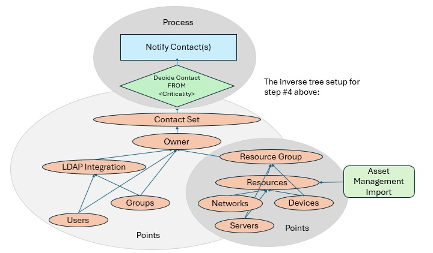

Autopilot:
-----------------------------------------------------------------------------

NOTE: The project has been re-written from a front-end that just runs canned scripts and RESTful calls to a full-fleged frontend and middleware for Automation as a Service enablement. In that process, the name was also changed and a full Javascript admin interface was added that rests on top of a new RESTful API.

What is Autopilot?
----------------------------
Over the last 20 years, there's been a distinct trend. The growing user base has made it imperative in large companies that a new class of products come about, a term called Automation as a Service (AaaS). Automation as a Service is an umbrella that covers physical, hybrid, and cloud based automation across all three cloud tiers (SaaS, Iaas, and PaaS). Note that I say physical simply because any automation services can do both physical and cloud, and this was written to be used with both, although it's primarily meant to be based in an off-site, onsite, or hybrid cloud.

Until now, AaaS has primarily used Enterprise apps and allowed hooks between them to creake a workflow chain. These workflows use Slack, SericeNow, and other Enterprise apps to initiate tickets and other processes that automate some management tasks. Sadly, this rarely includes much in the way of RESTful API use or scripting to allow an easy method to hook into those workflows. So, infrastructure management was still mostly a manual process--things like setting up a new storage device, adding machines to backups, or allocating a LUN--that required human intervention. Worse still, until now most AaaS services required developers that would write a completely new cloud-based frontend interface to enable the workflows for anyone not directly a part of the infrascructure teams.

Autopilot is a full-fledged ready-made Frontend and Middleware that has an easy to hook into interface for RESTful APIs as only *ONE* of its many workflow parts. Another is that existing backend scripts can be imported and used in workflows. In addition to those capabilities, Autopilot is intended to be hooked into many other Enterpise data sources that can allow communication along the workflow process and other management functions that enable a completely automated Enterprise Infrastructure.

Let's take an example. Suppose you want to add a new backup to your company's backup software. You may have 5,000 system admins spread across multiple regions that do that task every day. For a storage group to accept that many tasks would be a show-stopper in a large company. Most large companies perform this task either through an existing ticketing system, Slack, or custom web-based frontend. Each of these three methods have their own drawbacks. But if we break down the process of adding a machine to backups for a memont, to see how it could be automated more effectively, we would have these companents:
1. A web-based form would need to take in the info from that request.
2. The request would need to be stored in a Database until completed.
3. A ticket may need to be created to track internal metrics.
4. E-mail back the end user telling them the request was entered successfully.
5. Operations may have to review the request. They may need to:
   5a. Make sure the machine is ping-able.
   5b. Check if the backup product is installed.
   5c. Put in a request to install the backup product.
   5d. Receive confirmation that the product was installed and progress the request.
6. The storage group may need to approve that capacity request, or address it if problems. So, now we have approvals from 3 different teams:
   6a. The team manager of the original requester.
   6b. The operations team signs off on its readiness.
   6c. The storage team signs off on capacity availability.
6. The machine would need to be added to the backup product.
7. Confirmation e-mails would need to be sent that the request was completed to the original stakeholders.

This is a lot of steps! Worse, these steps may change significantly depending on the company, the group, or the auditing requirements. A simple script could encapsulate a RESTful API to do it, but when managing an entire workflow like this, we need to think outside the box. AP is as far outside the box as it's possible to get. It can create a workflow that does all of these functions.

Autopilot is a dashboard that creates visual workflows built on smaller bits & pieces that can be combined into a configurable flowchart that can be easily changed. It uses sub-components (which are from our inverse tree) such as:
1. A workflow is a collection of Processes and Points.
   1a. Processes are things that perform work of some kind. That work can be:
       - workflow -- The end result of items below being combined into a full process.
       - function -- a function is simply several things below combined into a re-usable     flowchart.
       - scripts  -- work externally supported by Autopilot. They don't behanve well.
       - tasks  -- Rest APIs with full input/output that can be imported from any product.
       - Forms   -- For end users to enter data.
       - Data Pipes -- connections to Databases, ticketing systems, etc, only for data.
       - Triggers -- data points that can create alerts.
       - Resources -- end machines, devices, subnets, and other data needed for workflows.
   1b. Points are decision points and the data that drives the decision.
       - Decisions -- Using configured data to decide on directions in a workflow.
       - Alerts  -- A way to receive events from devices and put them in the workflow.
       - Metrics -- collections of data from Data Autopilot that can role up for monitoring.
       - owners -- The owner of a machine, task, etc.
       - groups  -- Owners and groups constitute "contacts".
       - schedules  -- schedules run scripts or tasks at an assigned time, not immediate.
       - timers   -- count-downs that can represent SLAs or other time frames.

So, looking at the points and processes in AP, we know that data management is one of our big chanlleges, and we can put a data flow together into several components like this:

This is what AP is. each step in the process relies on usually from 1 to 3 pieces of critical data. By chaining those pieces together, we make a workflow tree where things are easier to accomplish in an automated fashion.

Points are the only truly flatly configured items in Autopilot. Although every part of Ap is easy to re-configure at any point. It now has 3 main components:
   1. A python/Django middleware layer that can hook into any database and data tables are easy to define through files (not the DB).
   2. A Javascript Admin console that can help you visually see and draw connections between your automation components.
   3. A RESTful API that sits between these two and passes data, and can just as easily import or export data, allow components to be called from external sources, or send comminications to all of your enterprise teams.

Why use this instead of Ansible, chef, puppet, terraform, Python, bash, and other automation tools:

AP is not in any way a replacement for these tools. In fact, it *will* not ever replace the need for these. Instead, the idea is that scripts of every type are just one of many components in AP called "scripts" helpfully, and they are used in building a more thorough workflow. Anything that includes a well-behaved Restful or otherwise self-contained API is called a "task". So, for step #6 above where the machine is added to Netbackup, I could choose to do that with an existing Rest call to the backup software using a task, or I could write my own script, which may not have well-behaved JSON output and use that script instead. AP doesn't replace those items. Instead, it collects them into a single knowledgebase and allows them to be used in larger and more complicated workflows that can be visually changed and extended. No developers required.

Easy Extensibility
----------------------------
AP is evolving at this point. At first, it was simply a pretty way to help execute scripts. Now, its becoming a completely extensible frontend that's specifically written to be changed easily with little or no coding knowledge.

The end result of these integrations is hopefully a product that can be modified to do any type of company automations. Maybe even turned into a completely different app type with very little brainwork. It does not target any specific IT group, although it's intended to be for technical audiences.

Alpha releases should start within a few months, assuming it continues to develop as it is now.

Installation:
-----------------------------

AP is currently about 60% through dev to a first release. An alpha release will be coming soon. Installation will be via a docker container or tar file. Stay tuned

{Add instructions here....}