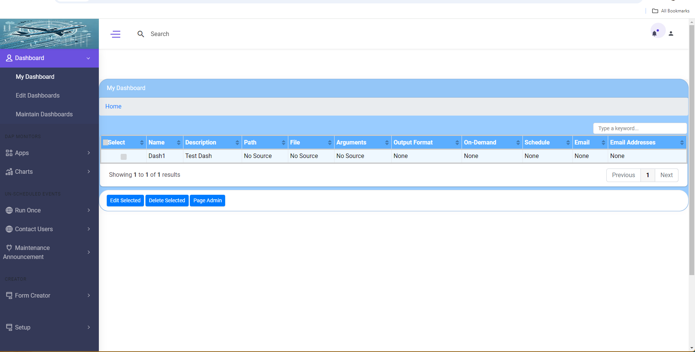

Autopilot:
-----------------------------------------------------------------------------

NOTE: The project has been re-written and the name changed and a full Javascript admin interface added that rests on top of a new RESTful API. A complete docker container config was added that allows the app to be portable to any cloud service, including local-only kubernetes configs. (NOTE that you can test this tool at any time and on any type of machine by using docker for desktops. You do not have to download and install it to get an idea of what it does. Just git clone the diretory and then use your docker compose command-line to fire it up. See below for details.)

What is Autopilot?
----------------------------
Over the last 20 years, there's been a distinct trend. A growing user base has made it imperative for large companies to have a new class of products, a term called Automation as a Service (AaaS). It's estimated that up to 30% of all company resources go to automation of some type now. 

Until now, AaaS has primarily used high-end Enterprise apps that allowed hooks between them to create a workflow chain of communication methods. These workflows use Slack, SericeNow, and other Enterprise apps to initiate tickets and other processes that automate some management communication. They could be triggered by softwar that supported webhooks, like NetApp Cloud Insights, but sadly, this rarely included any (or much) in the way of actual work from RESTful API calls or scripting to allow "work" to take place in those workflows. To my knowledge, Autopilot is the first tool that produces workflows with RestAPI calls and scripts built-in. Hopefully, this signals the end of times when infrastructure management was still mostly a manual process--things like setting up a new storage device, adding machines to backups, or allocating a LUN--those used to require human intervention. Worse still, until now most AaaS services required developers that would write a completely new cloud-based frontend interface to enable the workflows for anyone not directly a part of the infrascructure teams. Unless you physically communicated on the corporate network programs that supported those webhooks, in other words, you were not part of the workflow, and even within that workflow creation programming knowledge was generally required to produce a good automation flow. Autopilot is the first no-coide or low-code (depending on what you want to accomplish) interface attempted for Enterprise Infrastructures.

Autopilot is a full-fledged ready-made Frontend and Middleware that has an easy to hook into interface that can import the OpenAPI definitions from RESTful APIs and ready-made scripts already in the environment as only *ONE* of its many workflow parts. In addition to those capabilities, Autopilot is intended to be hooked into other Enterpise data sources that can allow communication along the workflow process and other management functions that enable a completely automated Enterprise Infrastructure. From ticket to resolution, no matter the infrastructure in between, autopilot will handle the scripting flows and communication the entire time, working *with* ticketing systems and corporate commincation flows to accomplish the task.

Automation as a Service is an umbrella that covers physical, hybrid, and cloud based automation across all three cloud tiers (SaaS, Iaas, and PaaS). Although that includes physical machine and VM installs as well, it's structure is written specifically for Kubernetes Clusters and AWS/Kubernetes by using docker as a container creation tool. It will run equally as well in any type of environment, however, physical or VM installs require a hard web server install (NGINX or Compatible ASGI server).

Let's take an example. Suppose you want to add a new backup to your company's backup software. You may have 5,000 system admins spread across multiple regions that do that task every day. For a storage group to accept that many tasks would be a show-stopper in a large company. Most large companies perform this task either through an existing ticketing system, Slack, or custom web-based frontend. Each of these three methods have their own drawbacks. But if we break down the process of adding a machine to backups for a memont, to see how it could be automated more effectively, we would have these companents:
1. A web-based form would need to take in the info from that request.
2. The request would need to be stored in a Database until completed.
3. A ticket may need to be created to track internal metrics.
4. E-mail back the end user telling them the request was entered successfully.
5. Operations may have to review the request. They may need to:
   5a. Make sure the machine is ping-able.
   5b. Check if the backup product is installed.
   5c. Put in a request to install the backup product.
   5d. Receive confirmation that the product was installed and progress the request.
6. The storage group may need to approve that capacity request, or address it if problems. So, now we have approvals from 3 different teams:
   6a. The team manager of the original requester.
   6b. The operations team signs off on its readiness.
   6c. The storage team signs off on capacity availability.
6. The machine would need to be added to the backup product.
7. Confirmation e-mails would need to be sent that the request was completed to the original stakeholders.

This is a lot of steps! Worse, these steps may change significantly depending on the company, the group, or the auditing requirements. A simple script could encapsulate a RESTful API to do it, but when managing an entire workflow like this, we need to think outside the box. AP is as far outside the box as it's possible to get. It can create a workflow that does all of these functions.

Autopilot is a dashboard that creates visual workflows built on smaller bits & pieces that can be combined into a configurable flowchart that can be easily changed. It uses sub-components (which are from our inverse tree) such as:
1. A workflow and function (functions are re-usable code contained in multiple workflows) is a collection of Processes and Points.
   1a. Processes are things that perform work of some kind. That work can be:
       - workflow -- The end result of items below being combined into a full process.
       - function -- a function is simply several things below combined into a re-usable     flowchart.
       - scripts  -- work externally supported by Autopilot. They don't behanve well.
       - tasks  -- Rest APIs with full input/output that can be imported from any product.
       - Forms   -- For end users to enter data.
       - Data Pipes -- connections to Databases, ticketing systems, etc, only for data.
       - Triggers -- data points that can create alerts.
       - Resources -- end machines, devices, subnets, and other data needed for workflows.
   1b. Points are decisions and the data that drives those decisions.
       - Decision -- Using configured data to decide on directions in a workflow.
       - Alerts  -- A way to receive events from devices and start the workflow.
       - Metrics -- collections of data output from Data Autopilot that can role up for analytics.
       - owners -- The owner of a machine, task, etc, that can be notified on events.
       - groups  -- Owners and groups constitute "contacts" for notification of events.
       - schedules  -- schedules can run part of all of a workflow at an assigned time, not immediate.
       - timers  -- count-downs that can represent SLAs or other time frames that trigger new workflow events.

This is what AP is. each step in the process relies on usually from 1 to 3 pieces of critical data. By chaining those pieces together, we make a workflow tree where things are easier to accomplish in an automated fashion. That tree of informtion flow can be changed:

   1. A python/Django middleware layer uses a database. Data tables ar extensible by adding models, and it uses a rest API to export data.
   2. A Javascript Admin front-end can help you visually see and draw connections between your automation components. It is written so that elements/pages can be added without code.

Autopilot should work equally well with system tools like Ansible, chef, puppet, terraform, Python, bash, and other automation tools.

Installation:
-----------------------------

AP is currently about 60% through dev to a first release. An alpha release will be coming soon. Installation will be via a docker container or tar file. Stay tuned

A docker-compose.yml file is offered which you can use to easily run the example project locally if you have docker installed. It consists of the following containers:

backend: The Django backend layer (all python) running allauth.headless. The backend runs on port 8000 andis accessible through Restful API and Allauth auth.

frontend: The frontend (React) project, running on port 3000. This includes the full GUI interface.

postgres: the postgres database which the backend depends on.

proxy: A proxy service (Traefik), running on port 8011, that, depending on the URL/connection, forwards either to the postgres, backend or frontend service, depending on which is managing that service.

mail: A dummy email (SMTP) service (MailCatcher) for development. that you can use to test e.g. email verification and password reset flows. Since there is no alpha release, there is no true e-mail service yet.

To spin up the full app, run:

$ docker compose up
Then, once the containers are built and running, open your favorite browser and visit the app at http://localhost:8011.
